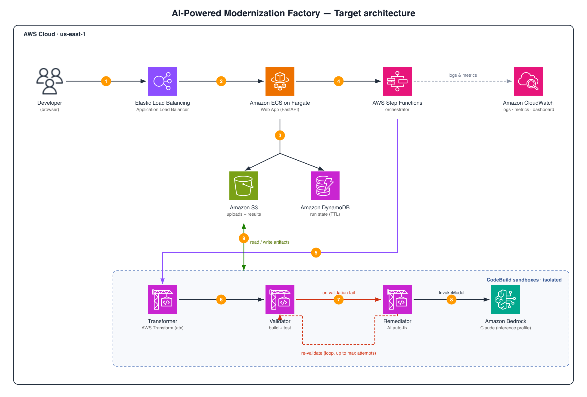
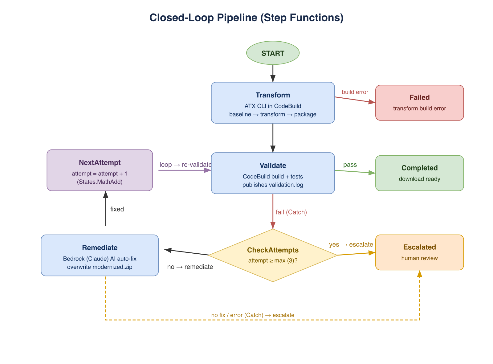
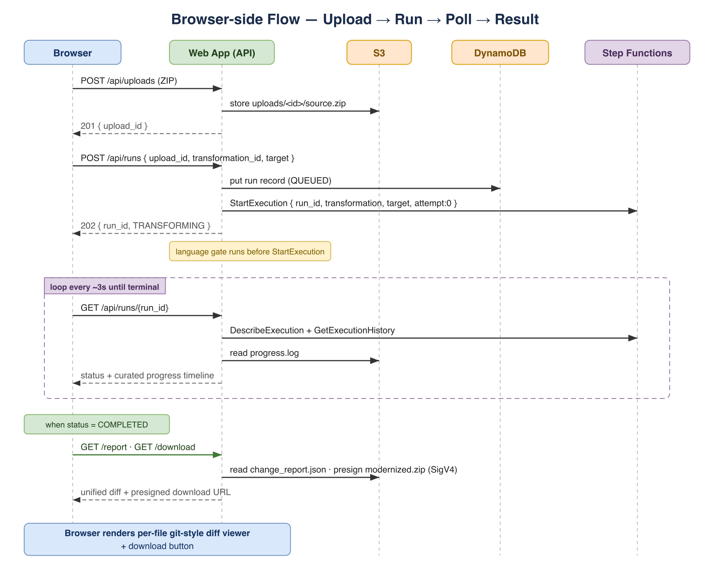

# AI-Powered Modernization Factory - Terraform IaC

> This is sample code, for non-production usage. You should work with your
> security and legal teams to meet your organizational security, regulatory,
> and compliance requirements before deployment.

## Architecture

**System architecture** - web app ([Amazon ECS](https://docs.aws.amazon.com/AmazonECS/latest/developerguide/Welcome.html)/[AWS Fargate](https://docs.aws.amazon.com/AmazonECS/latest/developerguide/AWS_Fargate.html)) + storage + [AWS Step Functions](https://docs.aws.amazon.com/step-functions/latest/dg/welcome.html) driving three [AWS CodeBuild](https://docs.aws.amazon.com/codebuild/latest/userguide/welcome.html) sandboxes (Transformer → Validator → Remediator), with the Remediator calling [Amazon Bedrock](https://docs.aws.amazon.com/bedrock/latest/userguide/what-is-bedrock.html):



**Closed-loop state machine** - `Transform → Validate`; on validation failure the run is auto-remediated by Bedrock and re-validated, looping up to `max_retry_attempts` before human escalation:



**Browser-side flow** - upload → start run → poll status/progress → render the git-style diff viewer + download:



> Editable diagram source: [`images/modernization_factory_diagrams.drawio`](images/modernization_factory_diagrams.drawio). SVG versions live alongside the PNGs in [`images/`](images/).

## Components

| Module | Resources | Purpose |
|--------|-----------|---------|
| `storage` | [Amazon S3](https://docs.aws.amazon.com/AmazonS3/latest/userguide/Welcome.html) (artifacts, results), [Amazon DynamoDB](https://docs.aws.amazon.com/amazondynamodb/latest/developerguide/Introduction.html) | Code artifacts + run state tracking (30-day TTL) |
| `codebuild` | Transformer, Validator, Remediator projects + [AWS IAM](https://docs.aws.amazon.com/IAM/latest/UserGuide/introduction.html) | [AWS Transform](https://docs.aws.amazon.com/transform/latest/userguide/what-is-service.html) (`atx`), build/test validation, and Bedrock-powered AI auto-remediation |
| `orchestration` | Step Functions, [Amazon CloudWatch](https://docs.aws.amazon.com/AmazonCloudWatch/latest/monitoring/WhatIsCloudWatch.html) Logs | Closed-loop state machine (Transform → Validate → Remediate ↺ → Complete/Escalate) |
| `webapp` | ECS/Fargate, [Elastic Load Balancing (ALB)](https://docs.aws.amazon.com/elasticloadbalancing/latest/application/introduction.html), [Amazon ECR](https://docs.aws.amazon.com/AmazonECR/latest/userguide/what-is-ecr.html) | FastAPI web app: upload, run, progress, diff viewer, download |
| `vpc` | [Amazon VPC](https://docs.aws.amazon.com/vpc/latest/userguide/what-is-amazon-vpc.html), subnets, NAT | Optional networking for the web app |
| `observability` | CloudWatch dashboard, alarms | Pipeline metrics and monitoring |

## Quick Start

### 1. Create the state backend

Terraform keeps its state in S3 with a DynamoDB lock table. Create them once - the bootstrap uses a local backend and auto-names the bucket `modernization-factory-tfstate-<account-id>` so it is globally unique:

```bash
make bootstrap
```

Then copy the `backend_config` value it prints into the (commented-out) `backend "s3"` block in `main.tf` and uncomment the block. S3 backends can't use variables, so the values must be literals:

```hcl
backend "s3" {
  bucket         = "modernization-factory-tfstate-123456789012"
  key            = "factory/terraform.tfstate"
  region         = "us-east-1"
  dynamodb_table = "modernization-factory-locks"
  encrypt        = true
}
```

### 2. Configure variables

```bash
cp terraform.tfvars.example terraform.tfvars
# Edit terraform.tfvars: set remediation_model_id,
# and deploy_webapp = true (requires Docker running locally).
```

> Enable [Amazon Bedrock model access](https://docs.aws.amazon.com/bedrock/latest/userguide/model-access.html) for a Claude model first, and set `remediation_model_id` to a cross-region inference-profile ID (for example `us.anthropic.claude-sonnet-4-5-20250929-v1:0`).

### 3. Deploy

```bash
make deploy
```

### 4. Get the web app URL

```bash
terraform output -raw webapp_url
```

## Running a modernization

> The ALB serves HTTPS with a self-signed certificate (HTTP redirects to HTTPS), so your browser will show a certificate warning you must accept. By default the ALB only accepts traffic from within the VPC CIDR — set `allowed_web_cidrs` to your network (for example `["203.0.113.4/32"]`) before deploying to reach it from your browser.

Open the web app URL in a browser, upload a codebase archive (a zipped project in the transformation's source language), choose a transformation from the dropdown (for example **Python version upgrade**), set the target, and start the run. The browser shows a live progress timeline; when the run completes you can review the per-file diff and download the modernized code.

The web app starts the Step Functions execution for you. To trigger a run programmatically, start an execution with the input the state machine expects:

```bash
aws stepfunctions start-execution \
  --state-machine-arn "$(terraform output -raw orchestration_state_machine_arn)" \
  --input '{
    "run_id": "run-0001",
    "source_key": "uploads/<upload_id>/source.zip",
    "transformation_name": "AWS/python-version-upgrade",
    "target": "3.12",
    "attempt": 0
  }'
```

## Configuration

| Variable | Default | Description |
|----------|---------|-------------|
| `remediation_model_id` | `us.anthropic.claude-sonnet-4-5-20250929-v1:0` | Bedrock inference-profile ID for the AI remediator |
| `max_retry_attempts` | 3 | Validate → remediate loops before human escalation |
| `deploy_webapp` | false | Deploy the ECS/Fargate web app (requires Docker locally) |
| `allowed_web_cidrs` | `[]` | CIDRs allowed to reach the web app ALB. Empty restricts to the VPC CIDR (private); set to your network to reach it from a browser |
| `create_vpc` | true | Create a new VPC, or reuse existing subnet IDs |
| `sns_escalation_topic_arn` | `""` | Optional SNS topic for human-review notifications |

## Extending beyond Python

The pipeline is transformation-agnostic: it forwards the chosen transformation name and optional target to the transformer, and the validator auto-detects the build system (Maven, Gradle, npm, or Python). To add coverage:

1. Add the transformation to the catalog (`src/catalog.py`) so it appears in the dropdown.
2. Confirm the validator's build-system detection covers the target language (extend it if needed).
3. The orchestration loop (Transform → Validate → Remediate ↺) is unchanged.

Java version upgrade (any JDK → any JDK) is included and verified end-to-end.

## Cost

You pay only for the AWS services this pattern uses, and actual cost depends on your usage (number and size of runs, remediation attempts, and how long the web app runs). Refer to each service's pricing page:

- [AWS Transform pricing](https://aws.amazon.com/transform/pricing/)
- [AWS CodeBuild pricing](https://aws.amazon.com/codebuild/pricing/)
- [Amazon Bedrock pricing](https://aws.amazon.com/bedrock/pricing/)
- [AWS Step Functions pricing](https://aws.amazon.com/step-functions/pricing/)
- [Amazon ECS pricing](https://aws.amazon.com/ecs/pricing/) · [AWS Fargate pricing](https://aws.amazon.com/fargate/pricing/)
- [Elastic Load Balancing pricing](https://aws.amazon.com/elasticloadbalancing/pricing/)
- [Amazon S3 pricing](https://aws.amazon.com/s3/pricing/)
- [Amazon DynamoDB pricing](https://aws.amazon.com/dynamodb/pricing/)
- [Amazon ECR pricing](https://aws.amazon.com/ecr/pricing/)
- [Amazon CloudWatch pricing](https://aws.amazon.com/cloudwatch/pricing/)

Use the [AWS Pricing Calculator](https://calculator.aws/) to estimate costs for your workload.

## Testing

```bash
make test          # python -m pytest
terraform validate # after: terraform init -backend=false
```

## Security

See [CONTRIBUTING](CONTRIBUTING.md#security-issue-notifications) for more information.

This sample follows the [AWS Shared Responsibility Model](https://aws.amazon.com/compliance/shared-responsibility-model/). AWS manages the security of the cloud infrastructure, while you are responsible for security in the cloud - including the IAM policies, encryption settings, network access controls, and Amazon Bedrock model access this pattern deploys. See [SECURITY.md](SECURITY.md) for design considerations and production-hardening guidance.

## License

This library is licensed under the MIT-0 License. See the [LICENSE](LICENSE) file.
